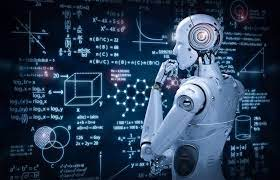

# 📚 Artifact Title: Collaborative Problem-Solving with AI in Machine Learning Training
### 🤖 AI Chatbot Interaction

## ✨ Introduction:
This artifact reflects my engagement in an interactive learning experience where I partnered with a pre-trained chatbot 🤖 to explore machine learning concepts, including supervised and unsupervised learning, reinforcement learning, and optimization algorithms. The objective was to deepen my understanding of these key topics through a collaborative, problem-solving approach that simulated a peer-to-peer learning environment 👥.

---

## 🎯 Artifact Description:

### Objective:
The primary objective of this activity was to enhance my understanding of machine learning training methods through a series of questions that required collaboration with a chatbot 💬. The chatbot served as a guide and collaborator, providing feedback, hints, and asking probing questions that helped reinforce my knowledge of critical machine learning concepts 💡.

### Process:
The activity involved a structured dialogue with the chatbot, where I was prompted with specific questions related to different machine learning techniques. As I worked through the questions, I engaged in critical thinking 🧠 and problem-solving 🛠️, discussing my answers and receiving immediate feedback from the AI. This interaction allowed me to apply theoretical knowledge to real-world scenarios 🌍, sharpening both my theoretical and practical understanding of machine learning.

The process was individually conducted, with the chatbot facilitating the learning journey. It acted as both a mentor 👨‍🏫 and a collaborative partner, creating a dynamic and engaging environment for problem-solving.

---

## 🛠️ Tools and Technologies Used:
The main tool used was the AI-powered chatbot, which provided real-time feedback and responses based on my input. The platform utilized adaptive AI technology 🧠 that personalized the experience, tailoring the chatbot's responses to my level of understanding and learning pace. Additionally, the chatbot could engage in multilingual communication 🌐, making it accessible for users in various languages.

---

## 💎 Artifact-Specific Value Proposition:

### Unique Value:
This artifact showcases my ability to engage in self-paced learning and problem-solving using advanced AI tools 🧰. It highlights my capacity to understand and navigate machine learning concepts, while simultaneously strengthening my collaboration and critical thinking skills. By collaborating with AI, I also honed my ability to adapt to new learning methods and technologies 🔄.

### Relevance:
This artifact is directly relevant to my personal value proposition as someone who values innovative, interactive learning environments ✨. It also aligns with my target audience's needs, as it demonstrates my proficiency in applying machine learning concepts through practical, real-world scenarios 🌍. The experience of collaborating with an AI tool highlights my comfort and skill with emerging technologies, preparing me for the evolving landscape of AI and machine learning 🚀.

---

## 🎯 Customization for Audience:

### Adaptations Made:
The artifact was customized through the interactive nature of the chatbot, which adapted to my inputs and provided tailored guidance 🧩. The chatbot could adjust the complexity of its questions and explanations based on my understanding, ensuring that the content was always relevant and at the appropriate level 📈.

### Relevance:
The customizations made the activity more engaging and pertinent by providing immediate feedback, real-time problem-solving, and opportunities for deeper exploration of machine learning topics. This experience also catered to different learning preferences 🧠, allowing me to engage with the material at my own pace and receive personalized support from the AI 🗣️.

---

## 🤔 Reflection:

### Significance:
I chose this artifact because it embodies a modern approach to learning that combines theory with real-world applications. The activity not only enhanced my understanding of machine learning training methods 📘 but also allowed me to experience the power of AI as a learning companion 🤖. This artifact demonstrates my ability to adapt to innovative technologies and apply complex concepts in practical scenarios, a valuable skill for future career opportunities in data science and machine learning 📊.

### Lessons Learned:
During this experience, I learned the importance of interactive learning and how AI can be used as a valuable tool for reinforcing knowledge 🧠. The immediate feedback and dynamic interaction helped me identify areas where my understanding could be improved and provided the opportunity to explore these concepts further 🔍. This process has strengthened my critical thinking skills, and I now feel more confident in applying machine learning techniques to real-world problems 💪.

---
