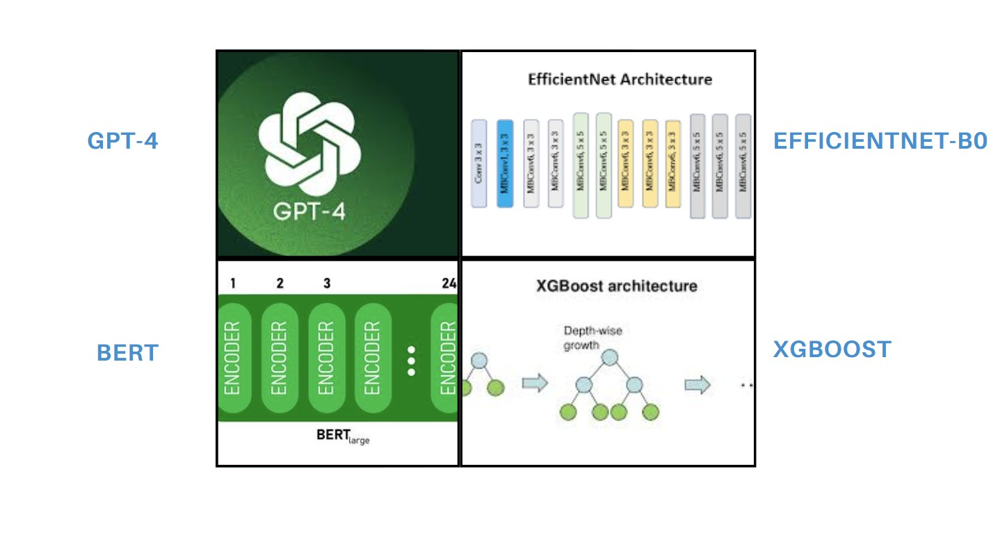
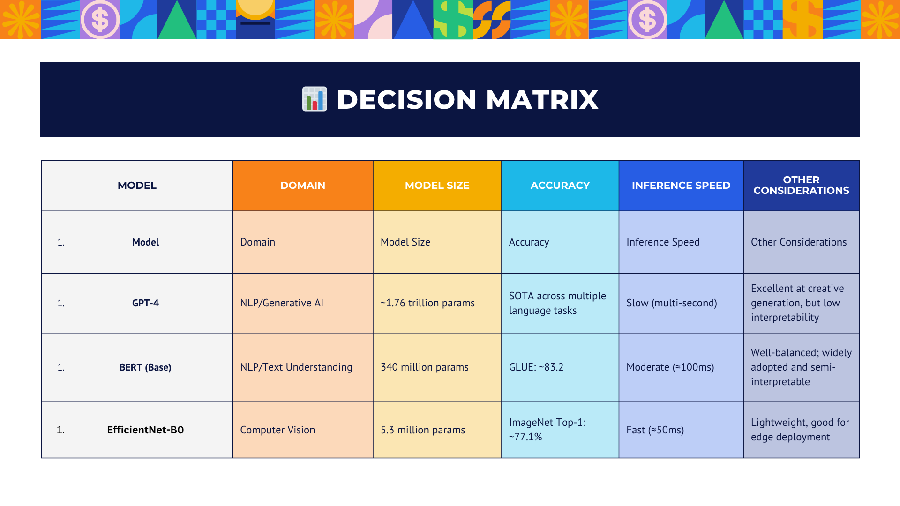

# 🤖 Comparative Analysis of Pre-Trained AI Models Across Domains

## 📘 Introduction
In AI model selection, it’s crucial to balance accuracy, efficiency, and explainability. Pre-trained models across different domains (NLP, vision, tabular data) each have unique strengths, but also limitations. High-performing models may be computationally expensive or lack transparency, making them unsuitable for real-time or regulated applications. Explainability ensures trust and accountability, especially in domains where human oversight or ethical implications matter. This analysis evaluates trade-offs across pre-trained models to guide effective and responsible model selection.

## 📝 Description
This artifact presents a comparative study of four pre-trained models—**GPT-4, BERT, EfficientNet-B0, and XGBoost**—spanning NLP, computer vision, and structured data domains. Each model is analyzed for its size, benchmark accuracy, inference speed, and practical considerations such as interpretability and deployability. The goal is to provide a balanced overview to support informed decisions in model deployment.

## 🎯 Objective
To compare leading pre-trained AI models across different domains by evaluating trade-offs in performance, speed, size, and explainability. This supports developers, data scientists, and decision-makers in selecting the most appropriate model for their specific use cases.

## 🔍 Process
- **Model Selection:** Chose one or two models from each domain—NLP (GPT-4, BERT), Computer Vision (EfficientNet-B0), and Tabular Data (XGBoost).

- 

  

- **Data Collection:** Gathered technical specifications and benchmark results from official documentation and research sources.  
- **Comparison Criteria:** Analyzed each model by:  
  - 📏 Model Size (parameters or memory footprint)  
  - 🎯 Accuracy (on standard benchmarks like GLUE, ImageNet, Kaggle)  
  - ⚡ Inference Speed (latency or throughput)  
  - 🛠️ Practical Considerations (ease of deployment, interpretability, energy use)  
- 📊 **Visualization:** Presented findings in a structured decision matrix.

## 🛠️ Tools and Technologies Used
- Model Documentation: OpenAI, Google AI, arXiv  
- Benchmark Sources: GLUE Benchmark, ImageNet, Kaggle Leaderboards  
- Comparison Design: Excel (for raw data), Canva (for infographic creation)  
- Models Studied: GPT-4, BERT, EfficientNet-B0, XGBoost

## 💡 Value Proposition
This artifact empowers AI practitioners to make strategic model choices aligned with technical needs and deployment environments. It combines research, critical thinking, and data analysis to address the growing complexity of AI tool selection in production environments.

## 🌟 Unique Value
Unlike generic model comparisons, this artifact uniquely focuses on explainability and speed-performance trade-offs—factors critical for real-time and ethically sensitive applications. It distills complex research into an actionable, readable matrix.

## 🌐 Relevance
In industries where AI adoption is accelerating, knowing which pre-trained models best fit specific applications is a core competency. This project illustrates applied analytical skills and the ability to translate technical complexity into decision-ready insights—valuable for any AI/ML portfolio.

## 📊 Decision Matrix

  

## 📈 Analysis & Recommendations
GPT-4 is unmatched in language generation and creativity but requires significant computing power and has low transparency. Best for high-impact generative applications like chatbots or summarization tools. 😊

BERT strikes a balance between accuracy and inference speed, making it a dependable choice for text classification, search, and Q&A systems where moderate latency is acceptable. 👍

EfficientNet-B0 is compact and optimized for performance, making it ideal for image recognition on mobile or embedded devices. It sacrifices a bit of interpretability for speed and size. 📱

XGBoost is the gold standard for structured/tabular datasets, offering speed, accuracy, and interpretability, and is best for domains like finance, health, or customer analytics where explainability is key. 💼

## ✅ Conclusion
Model selection isn’t just about raw performance—it's about the right fit for the task. GPT-4 leads in natural language creativity but demands resources. BERT and EfficientNet provide balance in their domains, while XGBoost offers high interpretability and speed for structured data. Understanding these trade-offs ensures responsible AI use and effective deployment tailored to the use case.

## 📚 References
- OpenAI. (2023). *GPT-4 Technical Report*.  
- Devlin, J., Chang, M.-W., Lee, K., & Toutanova, K. (2018). BERT: Pre-training of Deep Bidirectional Transformers for Language Understanding. *arXiv preprint arXiv:1810.04805*.  
- Tan, M., & Le, Q. V. (2019). EfficientNet: Rethinking Model Scaling for Convolutional Neural Networks. *Proceedings of the 36th International Conference on Machine Learning (ICML)*.  
- Chen, T., & Guestrin, C. (2016). XGBoost: A Scalable Tree Boosting System. *Proceedings of the 22nd ACM SIGKDD International Conference on Knowledge Discovery and Data Mining*.
