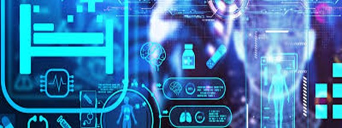

# **Artifact Title**  
Revolutionizing Business: AI Innovations Across Healthcare, Retail, and Education  

## **Introduction**  
This artifact showcases my ability to design and implement AI-driven solutions across three key industries: healthcare, retail, and education. Each project within this artifact highlights the transformative power of Artificial Intelligence (AI) to address industry-specific challenges. By developing predictive diagnostics in healthcare, customer sentiment analysis tools in retail, and adaptive learning platforms in education, I have demonstrated my versatility and technical expertise. This artifact underscores my commitment to creating practical, impactful solutions that align with the unique needs of different sectors.  

## **Artifact Description**  

### **Objective**  
The overarching objective was to create innovative AI-based solutions to solve real-world problems across three industries:  
- **Healthcare:** Develop a predictive model for early detection of chronic diseases to improve patient outcomes.  
- **Retail:** Enhance customer engagement through sentiment analysis, enabling businesses to refine their strategies.  
- **Education:** Personalize learning experiences using an adaptive platform powered by AI, fostering better educational outcomes.  

### **Process**  

#### **Healthcare**  
1. **Problem Identification:** Chronic diseases often go undetected until late stages. The goal was to use data to predict risks early.  
2. **Data Preparation:** Collected anonymized patient data, including demographics, medical history, and lab results.  
3. **Model Development:** Built a predictive analytics model using Logistic Regression and Random Forest to identify high-risk patients.  
4. **Deployment:** Packaged the model into a REST API for integration into existing electronic health records (EHR) systems, ensuring seamless use by healthcare providers.  

#### **Retail**  
1. **Problem Identification:** Businesses struggle to understand customer feedback effectively due to the sheer volume of data.  
2. **Data Collection:** Scraped customer reviews from e-commerce platforms and social media.  
3. **Model Development:** Applied Natural Language Processing (NLP) techniques using pretrained BERT models to categorize customer sentiment into positive, negative, or neutral.  
4. **Insights Generation:** Provided actionable recommendations, such as improving product features or addressing common complaints, to enhance customer satisfaction.  

#### **Education**  
1. **Problem Identification:** Traditional learning systems lack personalization, leading to disengaged students.  
2. **Algorithm Design:** Developed an adaptive learning system using Reinforcement Learning algorithms to tailor content to individual student needs.  
3. **Testing:** Simulated student performance data to evaluate and refine the algorithm.  
4. **Platform Integration:** Built an interactive web-based platform for educators to monitor student progress and adjust teaching strategies.  

### **Tools and Technologies Used**  
- **Programming Languages:** Python  
- **Libraries:** Scikit-learn, TensorFlow, NLTK, BERT  
- **Frameworks:** Flask for API development  
- **Visualization Tools:** Tableau, Power BI  
- **Database Systems:** MySQL  
- **Cloud Platforms:** AWS, Azure  

## **Artifact-Specific Value Proposition**  

### **Unique Value**  
This artifact showcases a wide array of AI competencies, including predictive modeling, natural language processing, and reinforcement learning. It demonstrates my ability to approach problems with creativity and technical precision, adapting AI methodologies to distinct use cases.  

### **Relevance**  
The artifact aligns with my personal value proposition of delivering impactful AI solutions across industries. It is particularly relevant for organizations seeking versatile AI professionals who can address diverse challenges.  

## **Customization for Audience**  

### **Adaptations Made**  
- **Healthcare:** Simplified technical explanations and included visual aids to help medical professionals understand the model’s predictions.  
- **Retail:** Enhanced dashboards to make insights accessible to marketing and sales teams with minimal technical background.  
- **Education:** Created a demo version of the adaptive learning platform for stakeholders to experience its functionality firsthand.  

### **Relevance**  
These customizations ensure that the artifact resonates with both technical and non-technical stakeholders, enhancing its practical value and impact.  

## **Reflection**  

### **Significance**  
I selected this artifact to demonstrate my ability to innovate

