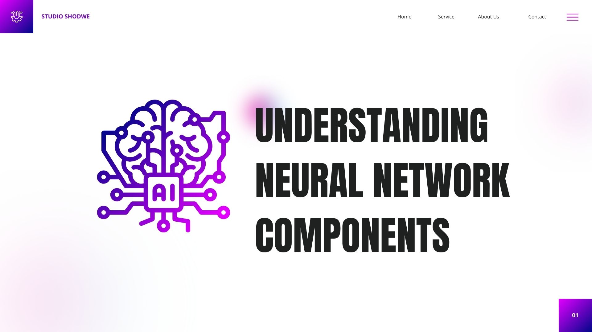
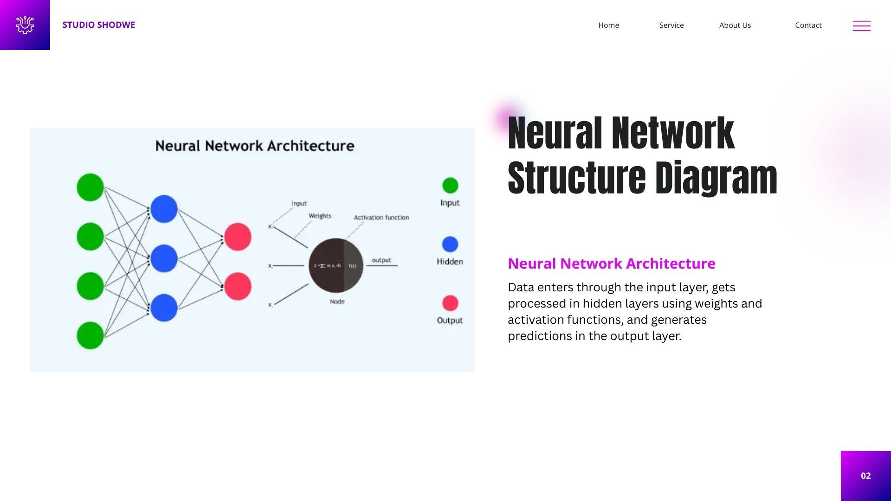
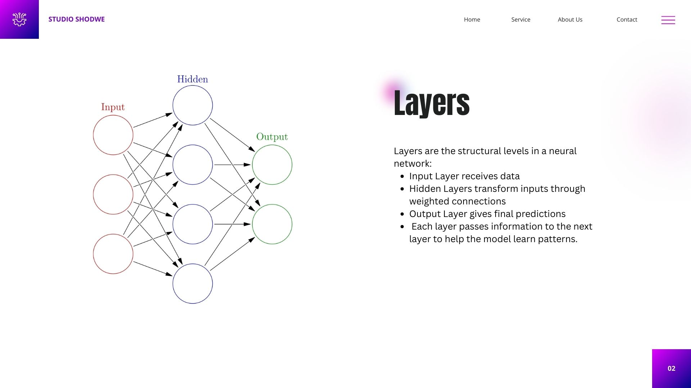
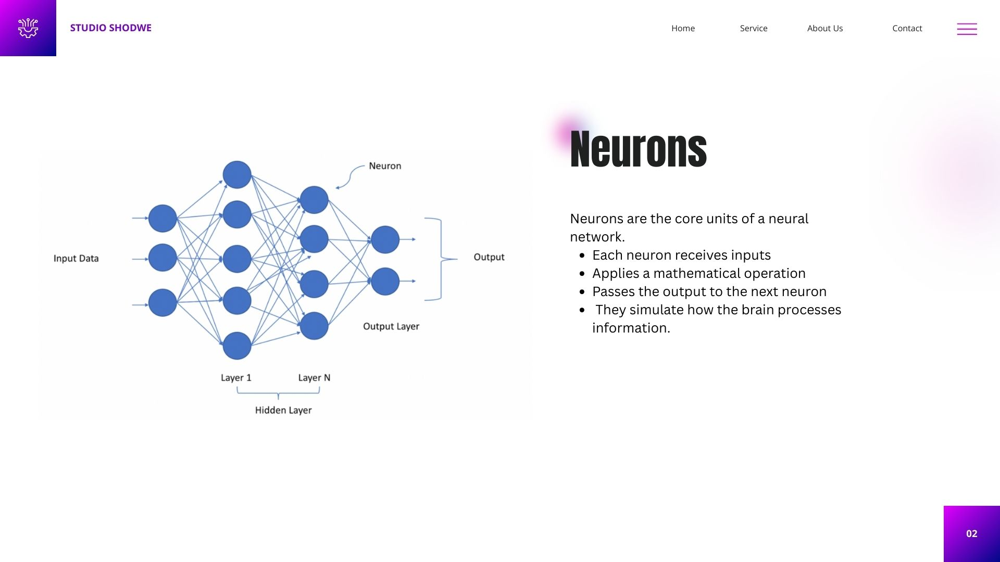
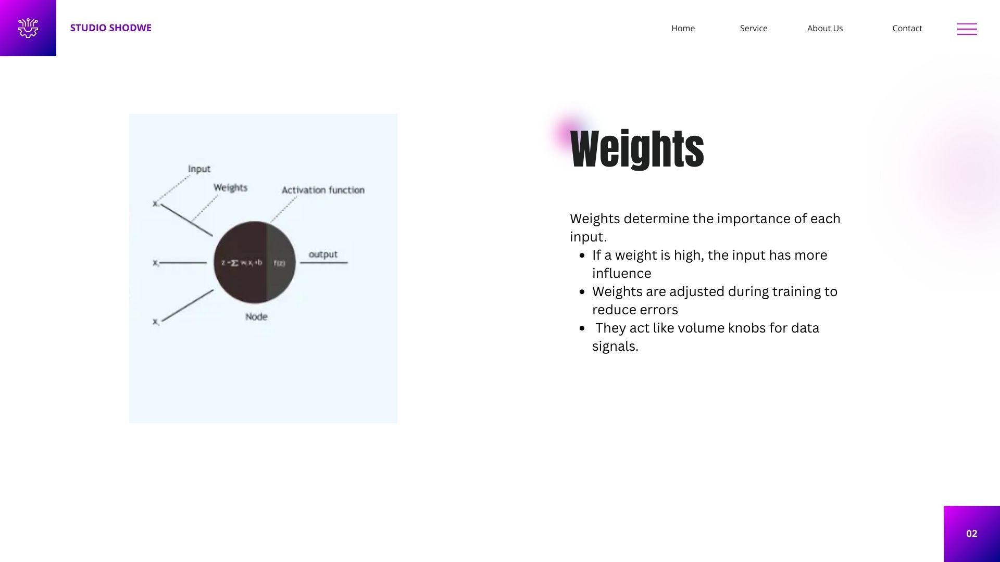
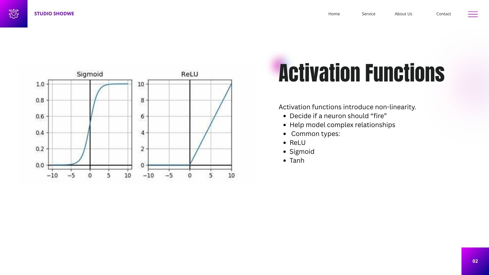
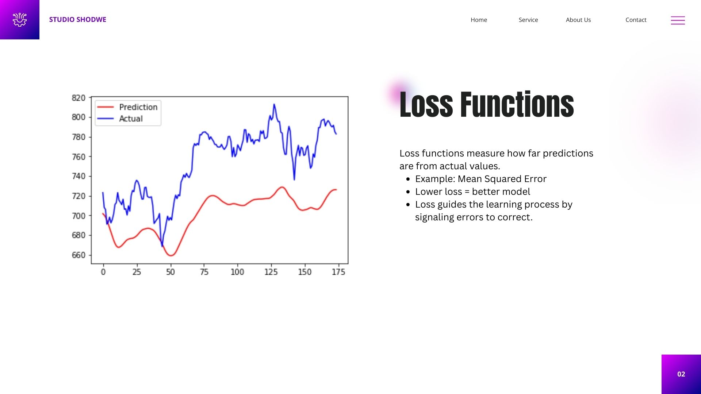
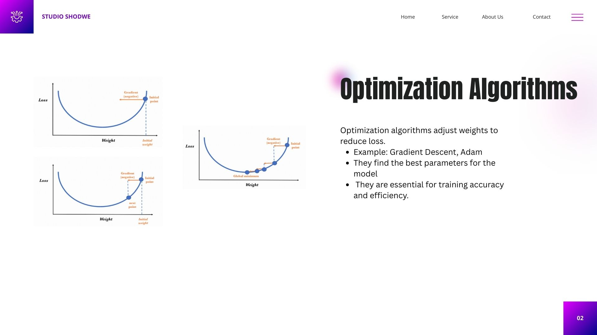

# Understanding Neural Network Components

  

## 📌 Introduction
This project presents a visual and conceptual breakdown of neural network architecture. Through diagrammatic slides, we explore how data flows through different components of a neural network, including layers, neurons, weights, activation functions, loss functions, and optimization algorithms.

## 📄 Description
A neural network mimics the human brain to recognize patterns and solve tasks like image classification, language translation, and more. This guide aims to demystify each component of the architecture by offering simplified visuals and explanations.

## 🎯 Objective
To build foundational understanding of how neural networks operate by:
- Visualizing neural network components
- Understanding their roles and interconnections
- Explaining how learning occurs through weight adjustments and loss reduction

### Neural Network Structure Diagram

  

### Layers
**Description:**  
- **Input Layer:** Receives raw data  
- **Hidden Layers:** Process data using weighted connections  
- **Output Layer:** Produces final output  
Each layer transmits information to the next, enabling the network to learn patterns.

  

### Neurons

  

### Weights

  

### Activation Functions

  

### Loss Functions

  

### Slide 8: Optimization Algorithms

  

### Summary & Key Insights
**Takeaways:**  
- Visual aids enhanced understanding of data flow  
- Components like layers, neurons, weights, and loss are vital  
- The Neural Network Playground helped test how components affect model behavior  
- Deep understanding enables smarter AI development

## 🛠 Tools and Technologies Used
- Visual Design Software (e.g., PowerPoint, Canva)
- Neural Network Playground (https://playground.tensorflow.org)
- Python (for testing models, not shown here)
- GitHub for documentation

## 💡 Value Proposition
This guide simplifies the learning process for neural networks by combining intuitive visuals with concise explanations—perfect for beginners or educators.

## 🌟 Unique Value
Unlike dense technical manuals, this guide adopts a visual-first approach that complements conceptual clarity with educational design.

## 📌 Relevance
With the growing application of AI in every field, understanding neural networks is crucial for students, developers, and business professionals alike.

## 📚 References
- TensorFlow Neural Network Playground: https://playground.tensorflow.org  
- DeepLearning.ai Course Material  
- Goodfellow, Bengio & Courville - *Deep Learning* (MIT Press)

